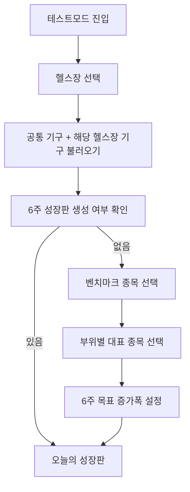
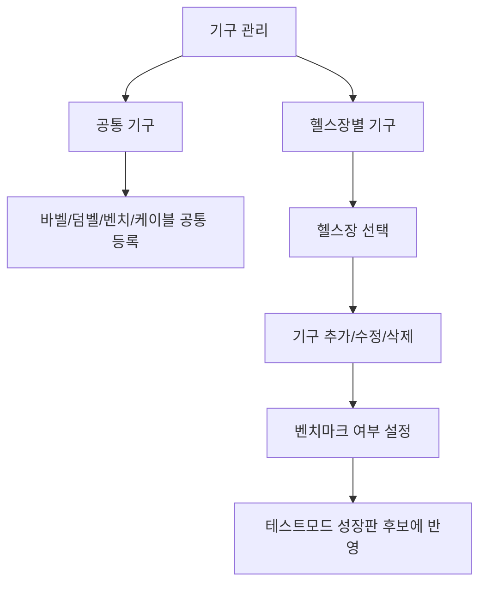

# 테스트모드 재설계 계획: 엑셀식 6주 성장판 기반

작성일: 2026-05-02
범위: 계획 문서. 실제 앱 코드 구현 아님.
참고 이미지: 사용자가 제공한 과거 엑셀 운동 관리표 캡처

---

## 1. 엑셀 방식에 대한 코치 관점 평가

### 1.1 이 방식이 강력했던 이유

이미지의 엑셀은 단순 기록지가 아니라, 6주 단위의 로드맵이었다.

핵심 구조는 다음과 같다.

1. 날짜가 세로축이다.
2. 부위별 핵심 종목이 가로축이다.
3. 각 칸에는 그 날짜에 수행해야 할 중량과 반복수가 들어간다.
4. 같은 종목도 `중중량 x 고볼륨`, `고중량 x 저볼륨`으로 나뉜다.
5. 6주 뒤 목표 중량이 미리 보인다.
6. 실제 수행이 계획과 맞았는지 바로 비교된다.

이 방식은 세계적인 내추럴 웨이트 트레이닝 관점에서도 충분히 합리적이다. 특히 약물 없이 회복 자원이 제한된 내추럴 트레이닝에서는 다음 원칙이 중요하다.

- 과도한 일일 무작위성보다 반복 가능한 기준 종목이 필요하다.
- 모든 종목을 PR 대상으로 삼지 말고, 부위별 대표 벤치마크를 정해야 한다.
- 고중량과 고볼륨은 역할이 다르므로 같은 종목군 안에서도 분리해야 한다.
- 4-8주 단위로 작게라도 숫자가 올라가야 성장 감각이 유지된다.
- 계획 중량과 실제 수행의 차이를 계속 봐야 다음 주 조정이 가능하다.

따라서 과거 엑셀식 프로그램은 지금도 작동할 가능성이 높다. 다만 앱으로 옮길 때는 그대로 복붙하기보다 다음 보완이 필요하다.

### 1.2 보완해야 할 점

| 항목 | 엑셀 방식의 강점 | 앱에서 보완할 점 |
|---|---|---|
| 6주 목표 | 미래 중량이 보임 | 실제 수행 실패 시 자동 조정 규칙 필요 |
| 대표 종목 | 부위별 벤치마크 명확 | 헬스장별 기구 차이를 반영해야 함 |
| 고중량/고볼륨 분리 | 성장 감각이 두 축으로 생김 | 세션 타입을 UI에서 명확히 분리해야 함 |
| 표 구조 | 한눈에 장기 흐름이 보임 | 모바일에서는 표를 그대로 쓰면 과밀함 |
| 수동 관리 | 본인이 계획을 통제함 | 앱은 추천하되 사용자가 수정할 권한을 줘야 함 |

### 1.3 현재 테스트모드에 적용 가능한 방법론

권장 기본 프로그램은 `Benchmark Linear Wave`다.

이름은 제품 내부명이고, 의미는 다음과 같다.

- 6주 메조사이클
- 부위별 핵심 벤치마크 종목 1개 이상
- 각 벤치마크는 두 트랙을 가짐
  - `볼륨 트랙`: 중중량 x 고볼륨
  - `강도 트랙`: 고중량 x 저볼륨
- 하체는 6주 +5kg, 상체는 6주 +2.5kg을 기본 진행폭으로 시작
- 목표를 못 맞춘 주는 다음 주 증량을 보류하거나 볼륨 트랙으로 되돌림
- 목표를 여유 있게 달성한 주는 예정 증량을 유지하거나 1주 앞당김

이 방식은 RP/5/3/1보다 사용자 경험 관점에서 더 적합하다. 이유는 사용자가 과거에 이미 성공 경험을 가졌고, 핵심 페인포인트가 "운동과학 브랜드"가 아니라 "미래의 내가 들 무게가 보이는 감각"이기 때문이다.

RP/5/3/1은 고급 옵션으로 남길 수 있다.

- RP Lite: 부위별 세트 목표 조정에 사용
- 5/3/1: 벤치/스쿼트/데드/OHP처럼 명확한 메인 리프트가 있을 때만 사용
- 기본값: 엑셀식 6주 벤치마크 성장판

---

## 2. 테스트모드 서비스 시나리오

### 2.1 첫 진입



### 2.2 성장판 생성

사용자는 모든 종목을 관리하지 않는다. 부위별 대표 종목만 선택한다.

예시:

| 부위 | 벤치마크 |
|---|---|
| 가슴 중부 | 벤치프레스 |
| 가슴 상부 | 인클라인 벤치 |
| 가슴 하부 | 딥스 또는 디클라인 |
| 플라이 | 케이블 플라이 |
| 등 넓이 | 랫풀다운 |
| 등 두께 | 바벨로우 |
| 하체 | 스쿼트 또는 레그프레스 |
| 이두 | 바벨컬 |
| 삼두 | 케이블 푸쉬다운 |

각 벤치마크는 두 트랙을 가진다.

| 트랙 | 목적 | 예시 |
|---|---|---|
| 볼륨 | 근비대, 반복수/총량 성장 | 72.5kg x 12 |
| 강도 | 무게 적응, 신경계/자신감 | 80kg x 8 |

### 2.3 오늘 화면

오늘 테스트모드의 첫 화면은 추천 리스트가 아니라 `오늘 날짜의 성장판 행`이어야 한다.

```text
오늘 9/14 · Week 1/6

가슴
벤치 볼륨      계획 72.5 x 12  → 실제 입력
벤치 강도      계획 80 x 8     → 실제 입력
인클라인       계획 50 x 12
플라이         계획 40 x 12

오늘 완료 후
계획 대비 달성률 87%
다음 주 증량 유지 / 보류 / 조정
```

### 2.4 주간/6주 화면

엑셀의 핵심 감각은 날짜별 미래 예측이다. 앱에서는 모바일 과밀을 피하기 위해 3단 구조로 보여준다.

1. 오늘 행
2. 이번 주 열람
3. 6주 성장판 전체

6주 성장판 전체는 가로 스크롤 표가 허용된다. 이 화면은 정보를 많이 보는 목적이므로 카드 UI보다 표 UI가 더 적합하다.

### 2.5 추천 메커니즘

추천은 아래 순서로 결정한다.

1. 오늘 선택한 헬스장
2. 공통 기구 + 해당 헬스장 기구
3. 오늘 큰 부위
4. 해당 부위의 벤치마크 종목
5. 오늘 날짜의 트랙
6. 지난 수행 결과에 따른 조정

조정 규칙:

| 실제 수행 | 다음 처방 |
|---|---|
| 목표 반복수 + RPE 8 이하 | 예정 증량 유지 또는 1주 앞당김 |
| 목표 반복수 달성 + RPE 9 | 예정대로 진행 |
| 목표 반복수 -1~-2 | 다음 주 동일 중량 재시도 |
| 목표 반복수 크게 실패 | 볼륨 트랙으로 후퇴 또는 -2.5kg |
| 통증/컨디션 이슈 | 해당 트랙 deload |

---

## 3. 헬스장별 기구 관리 계획

### 3.1 공통 원칙

일반/프로/테스트모드 모두 같은 기구 모델을 써야 한다. 모드마다 종목 풀이 달라지면 사용자는 "헬스장별로 섞인다"고 느낀다.

기구는 세 범위 중 하나를 가진다.

| scope | 의미 | 예시 |
|---|---|---|
| `global` | 헬스장 무관 공통 모듈 | 바벨, 덤벨, 벤치, 플레이트 |
| `gym` | 특정 헬스장 전용 | 해머 인클라인 머신, 특정 케이블 |
| `home` | 홈트/개인 장비 | 문틀철봉, 홈덤벨 |

### 3.2 데이터 모델 계획

```js
equipmentItem = {
  id,
  name,
  movementId,
  muscleIds,
  category: 'barbell' | 'dumbbell' | 'machine' | 'cable' | 'bodyweight',
  scope: 'global' | 'gym' | 'home',
  gymIds: ['gym_a'],       // scope='gym'일 때
  isBenchmark: true,
  benchmarkRole: 'volume' | 'intensity' | 'accessory',
  incrementKg: 2.5,
  maxWeightKg,
  notes,
}
```

### 3.3 CRUD 시나리오



### 3.4 모드별 사용

| 모드 | 기구 사용 방식 |
|---|---|
| 일반 | 공통 + 선택 헬스장 기구에서 직접 추가 |
| 프로 | 공통 + 선택 헬스장 기구로 루틴 생성 |
| 테스트 | 공통 + 선택 헬스장 벤치마크 기구로 6주 성장판 생성 |

### 3.5 중요 UX 원칙

- 바벨/덤벨은 헬스장에 종속시키지 않는다.
- 머신/케이블은 기본적으로 헬스장에 종속된다.
- 공통 기구는 모든 헬스장에서 보인다.
- 특정 헬스장 기구는 해당 헬스장 선택 시에만 보인다.
- 기존 종목은 기본적으로 `global`로 migration해서 사라지지 않게 한다.

---

## 4. 테스트모드 화면 재설계 원칙

### 4.1 현재 문제

현재 테스트모드는 정보 구조가 불명확하다.

- 오늘 무엇을 달성해야 하는지 약함
- 6주 뒤 어디까지 갈지 안 보임
- 부위별 대표 종목과 보조 추천이 섞임
- 추천 근거가 장기 계획과 연결되지 않음
- 카드마다 색/밀도/버튼 구조가 달라 산만함

### 4.2 새 정보 구조

```text
1. 상단: 헬스장 + 6주 성장판 상태
2. 오늘: 날짜/Week/달성률
3. 핵심 벤치마크: 오늘 수행해야 할 대표 종목
4. 보조 추천: 부족한 볼륨만 보완
5. 6주 성장판: 미래 중량과 실제 수행 비교
6. 기구 관리: 공통/헬스장 기구 CRUD 진입
```

### 4.3 TDS 적용 방향

- 카드 radius는 8px 기준
- 큰 컬러 블록 남발 금지
- primary는 토마토 레드만 사용
- 상태 색은 badge와 progress에만 제한
- 표는 어두운 엑셀 감성 대신 밝은 고대비 데이터 테이블로 재해석
- 버튼은 `fill / tonal / ghost` 위계로 정리
- 설명 문단보다 수치와 상태 배지를 우선한다.

---

## 5. 확인이 필요한 사항

실제 구현 전에 아래는 결정이 필요하다.

1. 6주 성장폭 기본값
   - 권장: 상체 +2.5kg, 하체 +5kg
2. 벤치마크 기본 종목
   - 권장: 사용자가 직접 선택하되, 앱이 후보를 추천
3. 강도/볼륨 트랙 개수
   - 권장: 핵심 종목만 2트랙, 보조 종목은 1트랙
4. 기존 테스트모드 추천 카드 유지 여부
   - 권장: 성장판 아래 보조 추천으로 강등
5. 엑셀식 전체표를 모바일에서 어느 정도까지 허용할지
   - 권장: 가로 스크롤 허용, 대신 오늘 화면은 압축 카드

